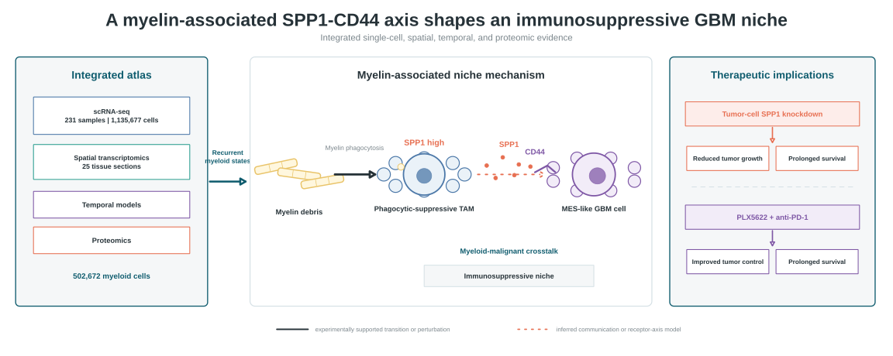

# Myeloid GBM Atlas

[](https://doi.org/10.5281/zenodo.18464315)
[](https://creativecommons.org/licenses/by/4.0/)
[](https://www.r-project.org/)
[](#repository-status)

**Code and processed data supporting an integrated single-cell, spatial, temporal, and proteomic analysis of the glioblastoma myeloid landscape.**

This repository accompanies the manuscript:

> **Integrated Single-Cell and Spatial Multi-Omics Decipher the Myeloid Landscape and Reveal the Myelin-Induced SPP1-CD44 Axis as a Therapeutic Target in Glioblastoma**

<p align="center">
  
</p>

The solid arrow denotes an experimentally supported transition or perturbation. The dashed arrow denotes inferred communication, spatial association, or the proposed receptor-axis model. The two intervention branches summarize distinct preclinical experiments and should not be interpreted as one combined protocol.

**Navigate:** [Study overview](#study-at-a-glance) · [Evidence boundaries](#biological-model-and-evidence-boundaries) · [Repository map](#repository-map) · [Data](#processed-data) · [Getting started](#getting-started) · [Citation](#citation)

## Study at a glance

| Evidence layer | Current scope | Role in the study |
|---|---:|---|
| Single-cell RNA sequencing | 26 datasets; 231 samples; 1,135,677 cells | Integrated GBM atlas and recurrent myeloid-state definition |
| Myeloid-cell compartment | 502,672 cells | Metaprograms, state transitions, and trajectory analyses |
| Spatial transcriptomics | 25 tissue sections | Myeloid-state localization, malignant-state relationships, and candidate signaling |
| Temporal models | GSE195848 workflows | Time-resolved state and expression-derived CNV analyses |
| Proteomics | WGCNA and enrichment workflows | Orthogonal network and pathway support |
| Functional studies | In vitro and preclinical models | Perturbation of the myelin-associated SPP1-CD44 axis and myeloid-targeted treatment strategies |

The central model is that myelin phagocytosis promotes an **SPP1-high phagocytic-suppressive TAM state**, which is associated with an immunosuppressive niche and candidate SPP1-CD44 signaling toward **MES-like GBM cells**.

## Biological model and evidence boundaries

1. **Integrated atlas:** single-cell, spatial, temporal, and proteomic analyses identify recurrent myeloid programs across GBM datasets.
2. **State transition:** the myelin-phagocytosis-to-SPP1-high-TAM transition is represented as experimentally supported.
3. **Myeloid-malignant crosstalk:** SPP1-CD44 communication toward MES-like GBM cells is presented as a receptor-axis model supported by communication, spatial, and functional evidence; the computational analyses alone do not prove direct molecular binding.
4. **Distinct intervention evidence:** tumor-cell SPP1 knockdown is linked to reduced tumor growth and prolonged survival, whereas PLX5622 plus anti-PD-1 is linked to improved tumor control and prolonged survival in a separate experiment.

> [!IMPORTANT]
> The repository does not treat CD8 T-cell restoration as an outcome of the tumor-cell SPP1-knockdown experiment. CellChat, MISTy, ISCHIA, and spatial colocalization results identify candidate interactions or dependencies and should not be interpreted as stand-alone causal evidence.

## Repository status

This is a **manuscript-associated analysis-code archive**, not a one-command software package. The scripts document the study workflows, but several retain workstation-specific absolute paths and require local path configuration before execution.

Before reusing a workflow:

1. download the processed objects from Zenodo and keep them immutable;
2. inspect the script's input, metadata, assay, and output assumptions;
3. replace workstation-specific paths with paths on your system;
4. record R, Python, and package versions;
5. write derived results to a separate `outputs/` directory;
6. use patient, sample, or animal identifiers—not cells or spatial spots—as independent units for inferential statistics when appropriate.

## Repository map

| Directory | Analysis scope | Representative content |
|---|---|---|
| [`GBmap/`](./GBmap/) | Integrated GBM single-cell atlas | Data conversion, myeloid subsetting, NMF, CytoTRACE2, and Monocle3 analyses |
| [`Spatial Analysis/`](./Spatial%20Analysis/) | Integrated spatial transcriptomics | Spatial WGCNA, metaprogram distribution, expression-derived CNV patterns, and spatial visualization |
| [`TAMs-MES/`](./TAMs-MES/) | Myeloid-malignant spatial relationships | CellChat, MISTy, ISCHIA, UKF sample analyses, and figure-oriented scripts |
| [`Temporal-GSE195848/`](./Temporal-GSE195848/) | Temporal mouse-model analysis | Data processing, CytoTRACE2/Monocle3, inferCNV, and CNV-score analyses |
| [`WGCNA_proteomics/`](./WGCNA_proteomics/) | Proteomic network analysis | WGCNA, module-gene objects, enrichment tables, and selected rendered outputs |
| [`assets/`](./assets/) | GitHub-page visual assets | Editable SVG overview, PNG fallback, and the R source used to generate the banner |

The repository currently contains 24 R analysis scripts. Script names and internal comments reflect the original workflow and may not correspond one-to-one with the final manuscript figure numbering.

## Processed data

The processed objects are openly available from [Zenodo record 18464315](https://zenodo.org/records/18464315) under the **CC BY 4.0** data license.

| File | Size | MD5 checksum | Intended role |
|---|---:|---|---|
| `GBM_Seurat_Object.rds` | 1,958,594,984 bytes | `df7b28f0379acac15a7522bde5219805` | Processed integrated single-cell GBM object |
| `stRNA-anno-level234_MPs.qs` | 2,404,637,055 bytes | `a02ea6feca025d79e558179cf0143073` | Processed spatial transcriptomics object with myeloid-state annotations |

Keep downloaded objects unchanged. A suggested local layout is:

```text
Myeloid_GBM_Atlas/
├── data/                 # downloaded objects; ignored by Git
├── outputs/              # derived tables, objects, and figures; ignored by Git
├── assets/
├── GBmap/
├── Spatial Analysis/
├── TAMs-MES/
├── Temporal-GSE195848/
└── WGCNA_proteomics/
```

Large data objects belong on Zenodo and should not be committed directly to GitHub.

## Getting started

Clone the repository and create local data/output directories:

```bash
git clone https://github.com/Du-GBM-Lab/Myeloid_GBM_Atlas.git
cd Myeloid_GBM_Atlas
mkdir -p data outputs
```

Download the two processed objects from Zenodo into `data/`. Then update the input and output paths in the workflow you intend to run.

Minimal R loading example:

```r
project_dir <- normalizePath("/path/to/Myeloid_GBM_Atlas")
data_dir <- file.path(project_dir, "data")
output_dir <- file.path(project_dir, "outputs")

dir.create(output_dir, recursive = TRUE, showWarnings = FALSE)

gbm_sc <- readRDS(file.path(data_dir, "GBM_Seurat_Object.rds"))
gbm_st <- qs::qread(file.path(data_dir, "stRNA-anno-level234_MPs.qs"))
```

Inspect each object before adapting an analysis:

```r
class(gbm_sc)
SeuratObject::Assays(gbm_sc)
SeuratObject::Reductions(gbm_sc)
colnames(gbm_sc[[]])

class(gbm_st)
SeuratObject::Assays(gbm_st)
colnames(gbm_st[[]])
```

Do not assume that assay names, normalization states, metadata fields, factor levels, or reductions are interchangeable across objects.

## Analysis routes

### Integrated single-cell atlas

Start in [`GBmap/`](./GBmap/) for data conversion, myeloid-cell processing, NMF-derived programs, CytoTRACE2, and Monocle3 analyses.

### Spatial analyses and myeloid-malignant relationships

Use [`Spatial Analysis/`](./Spatial%20Analysis/) for spatial metaprogram mapping, spatial WGCNA, and visualization. Scripts in [`TAMs-MES/`](./TAMs-MES/) contain CellChat, MISTy, ISCHIA, and related analyses of candidate myeloid-malignant spatial relationships.

### Temporal analysis

Use [`Temporal-GSE195848/`](./Temporal-GSE195848/) for GSE195848 processing, trajectory analysis, and expression-derived CNV analyses. Gene-position reference files used by inferCNV are under [`Temporal-GSE195848/cnv_ref/`](./Temporal-GSE195848/cnv_ref/).

### Proteomics

Use [`WGCNA_proteomics/WGCNA_proteomics.R`](./WGCNA_proteomics/WGCNA_proteomics.R) for proteomic WGCNA and enrichment analysis. Selected module objects, enrichment tables, and PDF outputs are included for inspection.

## Main software dependencies

The workflows primarily use R and, for selected analyses, Python through `reticulate`.

- single-cell analysis: `Seurat`, `SeuratObject`, `SingleCellExperiment`, `harmony`, `BPCells`;
- state and trajectory analysis: `GeneNMF`, `CytoTRACE2`, `monocle3`, `miloR`;
- spatial analysis: `spacexr`, `SPATA2`, `hdWGCNA`, `mistyR`, `ISCHIA`;
- communication analysis: `CellChat`, `nichenetr`;
- expression-derived CNV analysis: `infercnv`;
- enrichment and visualization: `clusterProfiler`, `fgsea`, `irGSEA`, `ggplot2`, `patchwork`, `pheatmap`;
- proteomics and network analysis: `WGCNA`, `matrixStats`.

A frozen software environment is not yet included. Reproduction attempts should save `sessionInfo()`, package versions, random seeds, input checksums, and the exact script commit.

## Interpretation boundaries

- CellChat, MISTy, ISCHIA, and spatial colocalization identify candidate communication or spatial-dependency patterns; they do not independently establish receptor binding, pathway activation, or causality.
- inferCNV produces expression-derived CNV-like patterns. DNA-level clonal conclusions require independent genomic validation.
- Cells and spatial spots are not independent biological replicates. Use patient-, sample-, or animal-level units for inferential statistics where appropriate.
- The therapeutic findings summarized here are preclinical and should not be presented as validated clinical treatment recommendations.

## Rebuilding the homepage banner

The graphical overview is generated from editable R/grid source rather than a raster-only or generative-AI asset:

```bash
Rscript assets/generate_readme_banner.R
```

This regenerates `assets/myeloid_gbm_axis.svg` and `assets/myeloid_gbm_axis.png`. The SVG is used on the GitHub homepage; vector and high-resolution QA exports are written locally to the ignored `assets/qa/` directory.

## Release roadmap

- [ ] Replace remaining hard-coded paths with a configuration file or command-line arguments.
- [ ] Add `renv.lock` and installation instructions.
- [ ] Add a figure-to-script and source-data manifest.
- [ ] Add ordered entry-point scripts or a workflow manager.
- [ ] Save `sessionInfo()` and random seeds for each major workflow.
- [ ] Add metadata dictionaries for the Zenodo objects.
- [ ] Add syntax and missing-input checks in continuous integration.
- [ ] Add `CITATION.cff`, a code license, and a tagged release aligned with the submitted manuscript.

## Citation

Until the peer-reviewed article is available, cite the processed data as:

> Du J, Hu S. *Integrated Single-Cell and Spatial Multi-Omics Decipher the Myeloid Landscape and Reveal the Myelin-Induced SPP1-CD44 Axis as a Therapeutic Target in Glioblastoma*. Zenodo. 2026. [https://doi.org/10.5281/zenodo.18464315](https://doi.org/10.5281/zenodo.18464315)

Please replace or supplement this entry with the final article citation after publication.

## License

The Zenodo data record is licensed under [CC BY 4.0](https://creativecommons.org/licenses/by/4.0/). A separate license for the analysis code has not yet been declared; public availability alone does not imply permission to reuse the code. The authors should select and add a code license before the archival release.

## Contact

For questions about the study, processed data, or analysis code, please open a GitHub issue or contact the corresponding authors listed in the manuscript.
